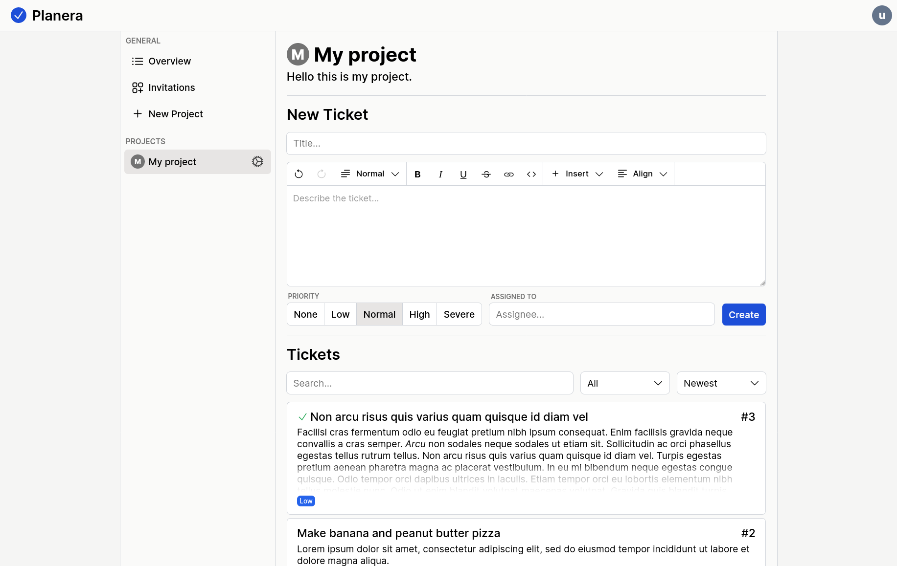

# Planera
A simple ticket-based project management web application.



## Getting Started

### Docker Compose

1. Clone the repository:
    ```shell
    git clone https://github.com/PaddiM8/Planera
    ```

2. Modify `/docker-compose.yml` and replace both instances of
   `http://localhost:2000` with your domain. Additionally,
   it is also possible configure email sending here.

3. Start docker compose:
    ```shell
    docker-compose up -d
    ```

Planera should now be running and listening at localhost:2000.

## Development

### Dependencies

* .NET 7
* Node
* NPM

### Setup

Start the backend:
```shell
cd api
dotnet run
```

Start the frontend:
```shell
cd web
npm install
npm run dev
```